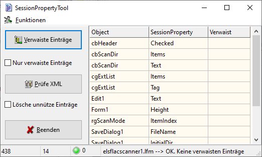

# SessionPropertiesTool

Helper tool for Lazarus IDE

Lazarus-IDE has Session Properties at the main form to store program settings for next start.

But if you try to rename objects that are already assigned to Session Properties,
these items will not be renamed.

This means, assignmet is lost and program settings are not kept.
Relicts with old object names are left in XML files. If many values are stored
in larger projects, it quickly becomes confusing. Usually, this behaviour
will be found only with intensive program tests.

To overcome this situation this tool will find orphaned items in
Session Properties, makes it easier to correct Session Properties and
avoid incomplete program settings.
The session properties must be stored as XML file! Support JSON or INI file
pending.
